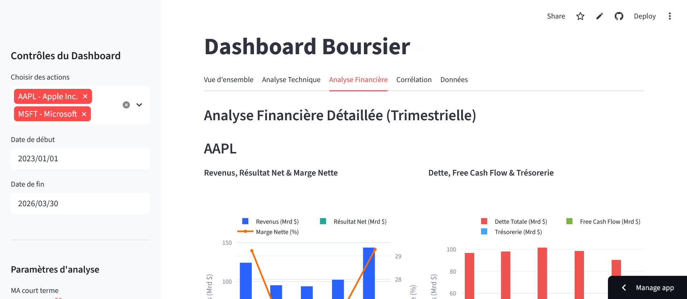

# 📈 Dashboard Boursier (Stock Market Dashboard)

A professional-grade real-time financial analysis dashboard built with **Streamlit** and **Yahoo Finance**. This application allows users to track S&P 500 stocks, perform technical analysis, and visualize quarterly financial health.

## ✨ Features

* **Real-time Intraday Tracking:** Live price updates and candlestick charts (refreshes every 30s during US market hours).
* **Technical Analysis:**
    * Simple Moving Averages (SMA) with customizable periods.
    * Bollinger Bands.
    * Relative Strength Index (RSI).
    * Volume Analysis (color-coded by price action).
* **Financial Deep-Dive:** * Quarterly Revenue and Net Income tracking.
    * Debt, Cash Flow, and Margin evolution.
    * Waterfall charts for Revenue-to-Net-Income conversion.
* **Correlation & Comparison:** Base 100 comparison and correlation heatmaps for multiple tickers.
* **Clean UI:** Modern design with custom CSS, professional color palettes, and organized tabs.

## 🛠️ Tech Stack

* **Language:** Python
* **Framework:** Streamlit
* **Data Source:** `yfinance` (Yahoo Finance API)
* **Visualization:** Plotly (Express & Graph Objects)
* **Data Handling:** Pandas, NumPy

